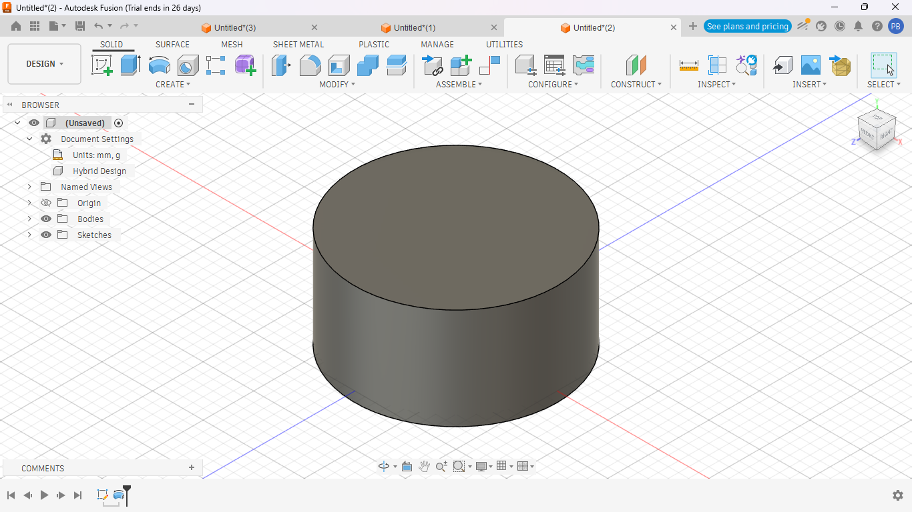
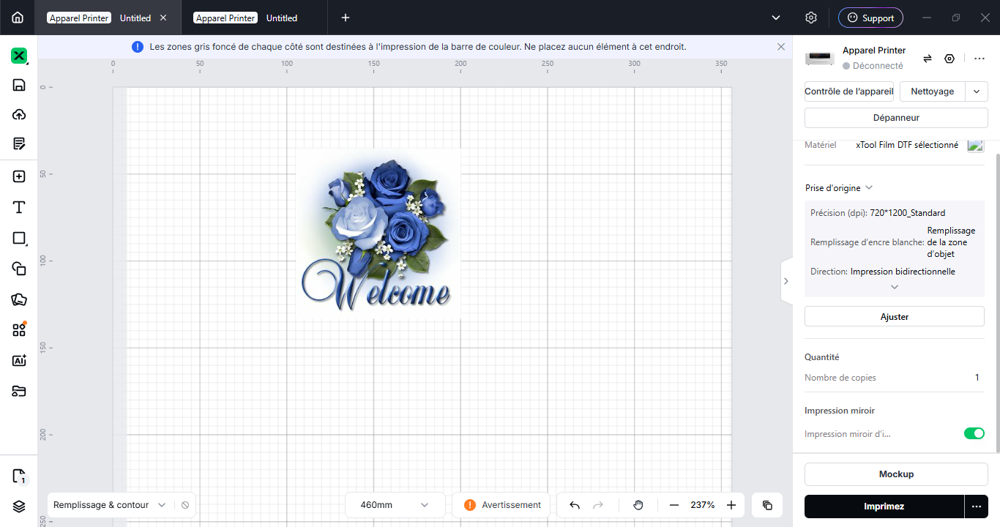
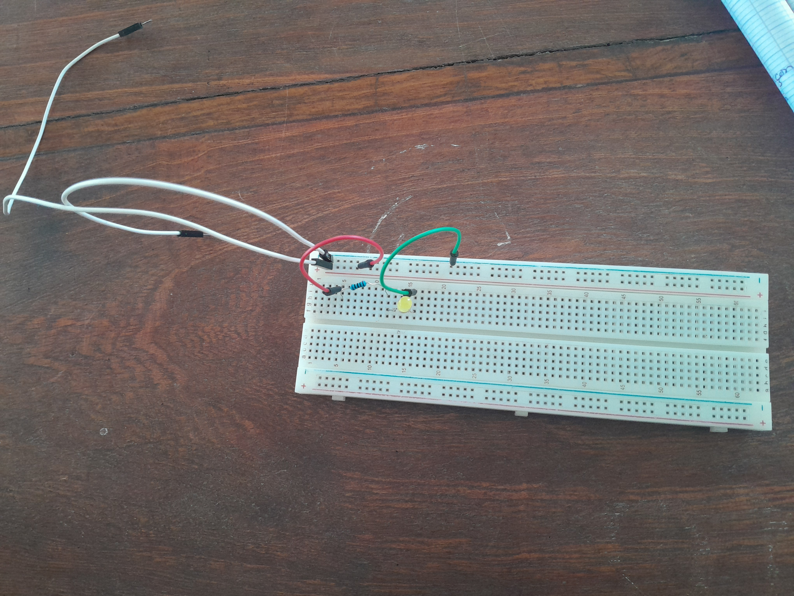
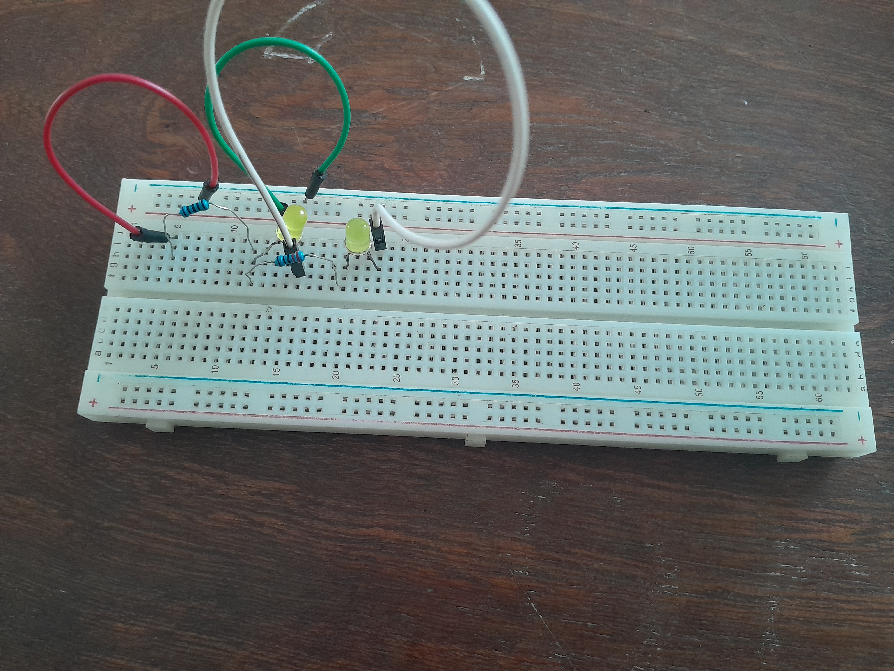
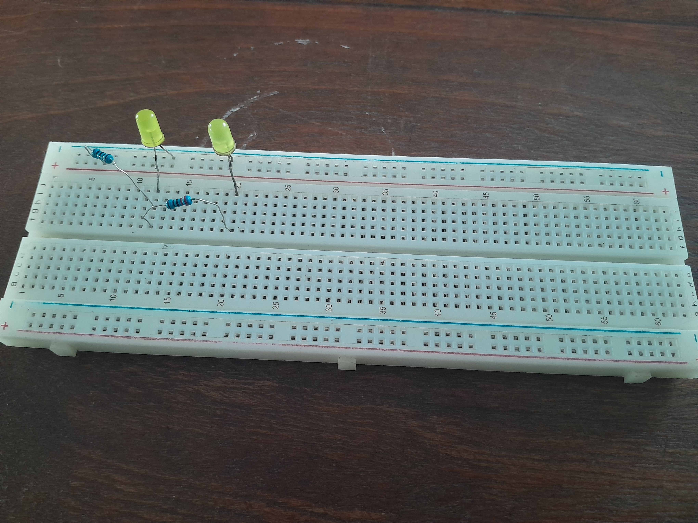
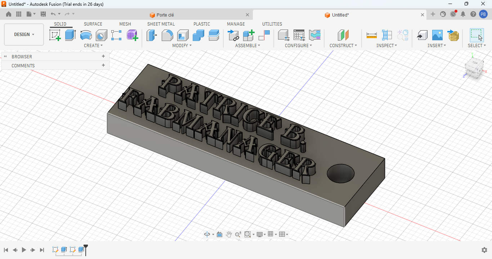
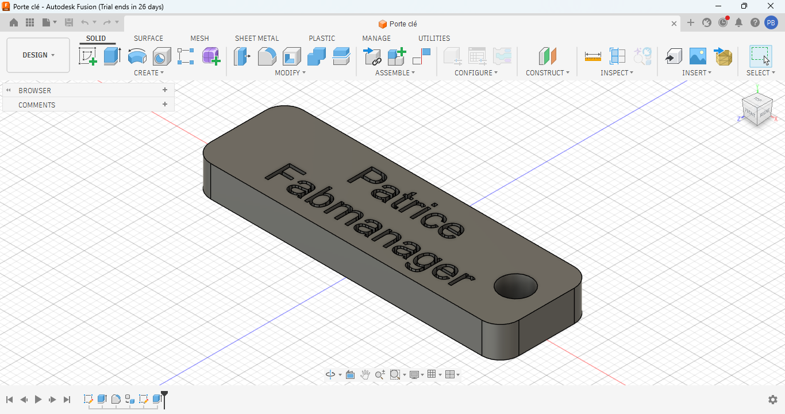

# Journal mardi 01 septembre 2026 (rédigé par : Patrice BOMBOMA)

## Fait aujourd'hui

- Travaillé avec le logiciel fusion
- Impression DTF avec xTool
- Utilisé une plaque Breadboad SK10 pour réaliser des montages de circuit

## Appris

- Utiliser 3 fonctions (Révolution, Estrusion et cylindre) pour créer un cylindre dans Fusion

- Les étapes du DTF
- Concevoir une inscription et l'imprimer

- Réaliser des momtages de circuit sur un Breadbord

## Raté, puis corrigé

- Difficulté à concevoir une insciption en creux sur une face d'un modele 3D → Cela était dû au choix d'une police non compatible

- Après changement avec une police compatible → résultat satisfaisant

