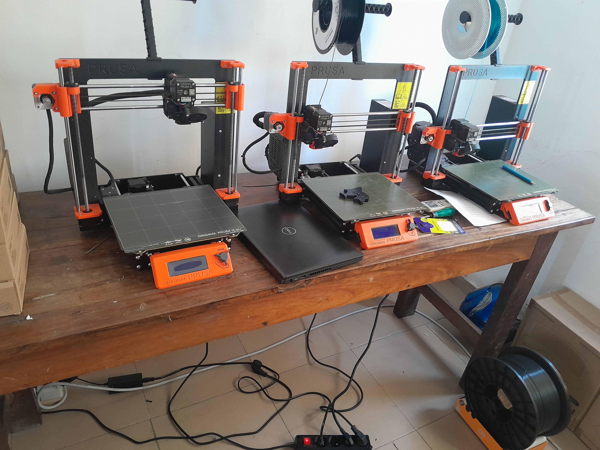
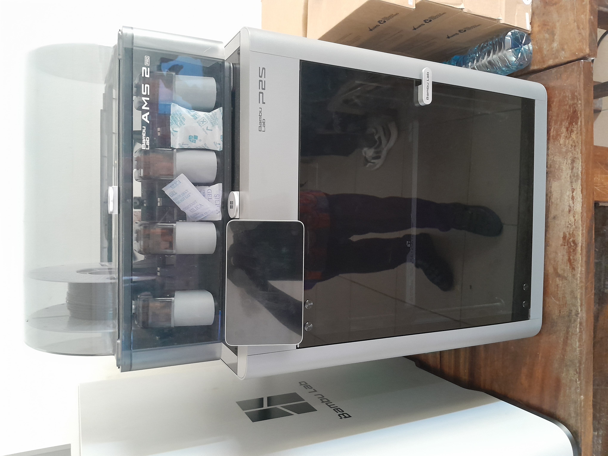
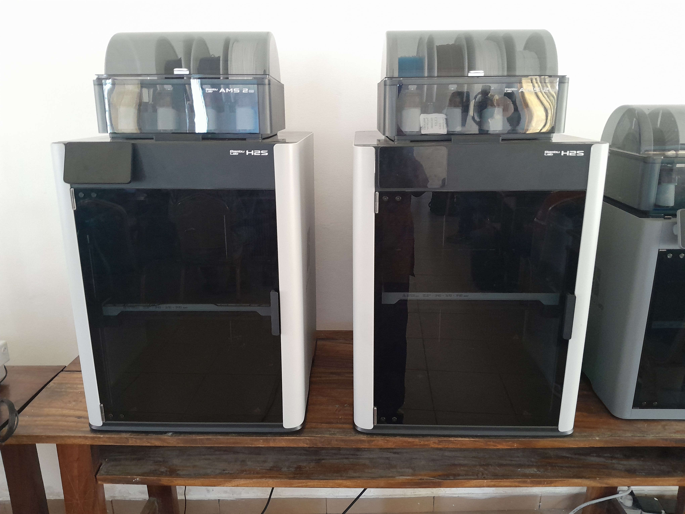
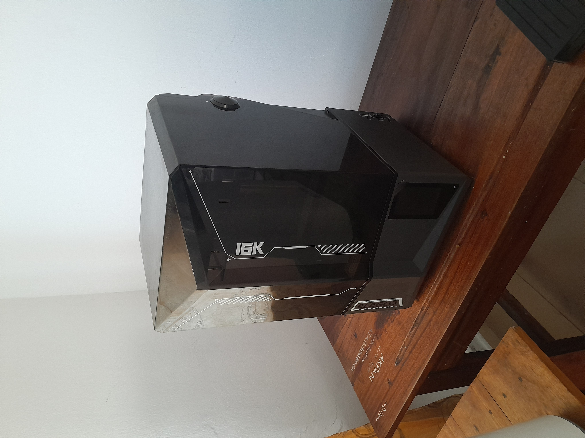
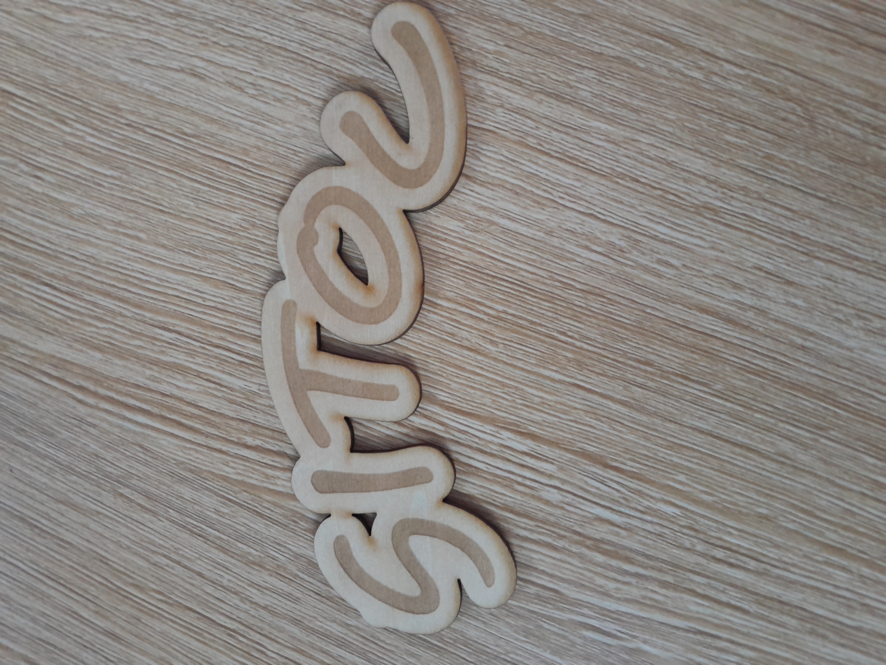
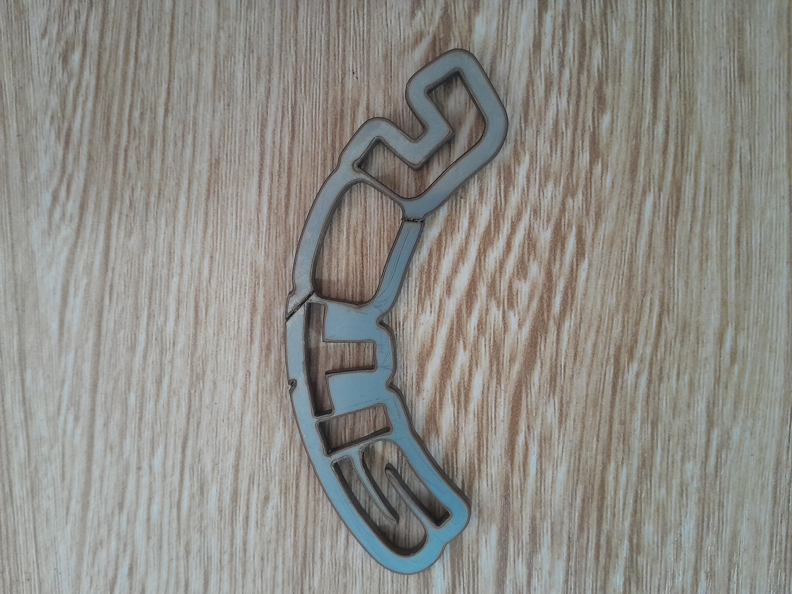
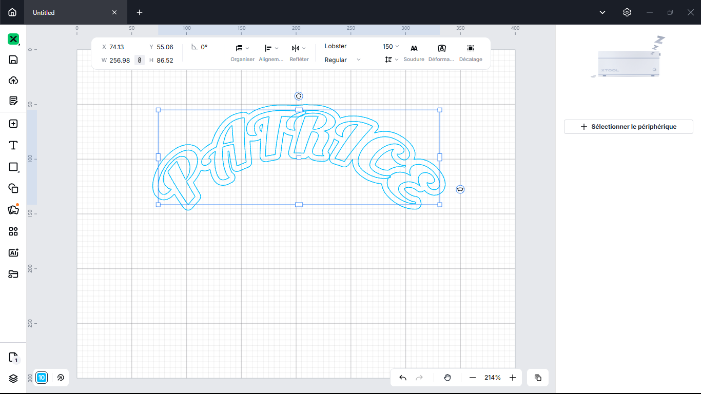

# Journal mercredi 26 août 2026 (rédigé par : Patrice BOMBOMA)

## Fait aujourd'hui

- Constitué 4 groupes de 23 ou 24 personnes

### Atelier électronique

- Rappel de quelques notions de base en électronique
- Mesure de tension, de résistance
- Notion d'entrées et sorties en électronique

### Atelier impression 3D

- Quelques notions de base en électronique et principes généraux à l'impression 3D
- Prise de connaissance de quelques imprimante 3D

### Atelier projet

- Echange sur différent sujet pouvant faire l'objet de nos projets

### Atelier découpe LASER

- Quelques notions de base sur le laser et la découpe
- Installer le logiciel xTool
- Fait un essai de gravure et de découpe

## Appris

- Utiliser un multimèttre pour mésurer la tension d'une pile et la résistance
- Le code couleur des conducteurs ohmique et leurs significations
- L'historique de l'imprimante 3D
- Les différents filaments utilisés en FDM (FFF)
- Choisir le filament en fonction du besoin
- Importance d'un bon paramétrage en fonction du filament choisi et du besoin
- L'anatomie d'une découpeuse laser
- Les 4 grandes famille de laser industrielle (CO2, Fibre, Diode et UV)
- Ecrire un texte (prénom) dans xTool et la découpe

## À faire demain

- Ecrire mon prénom et le découper au laser
