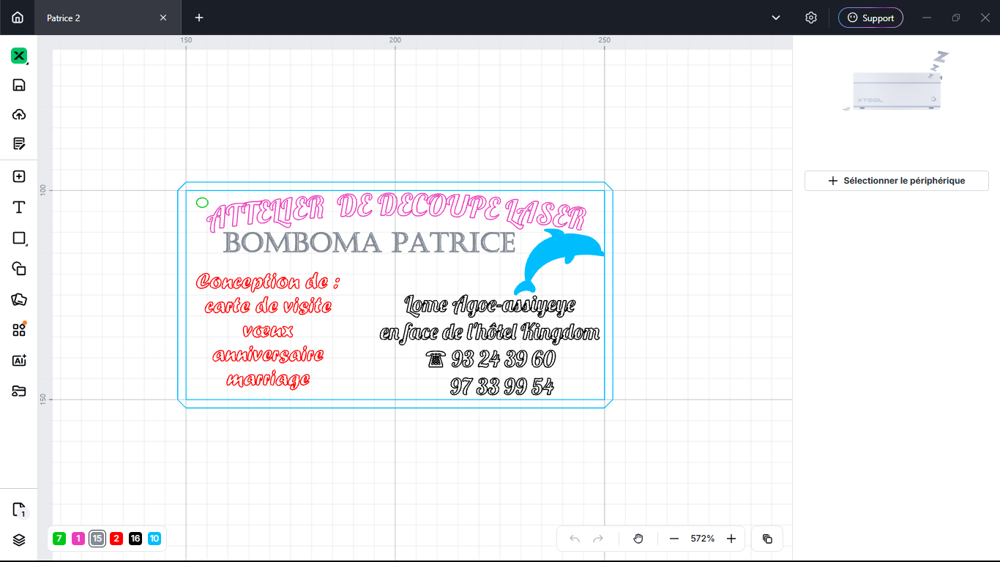
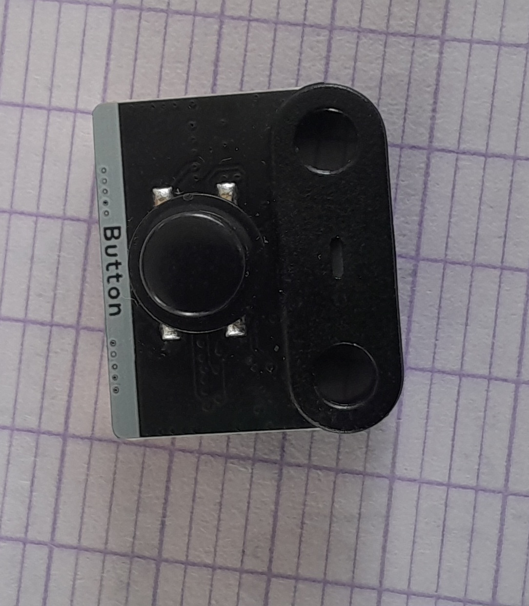
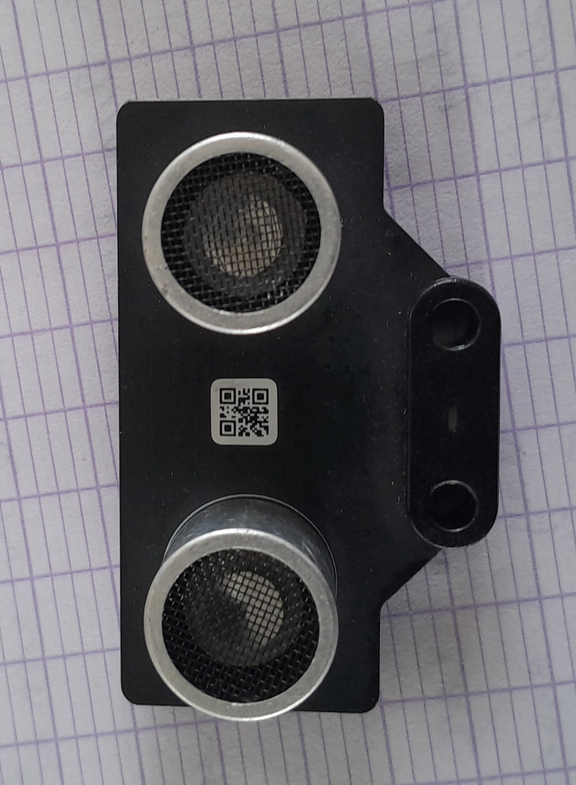
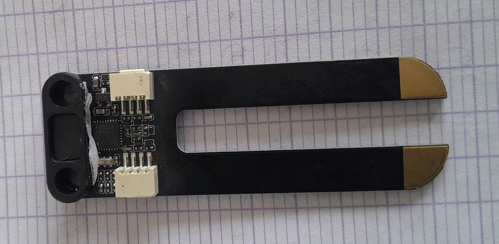
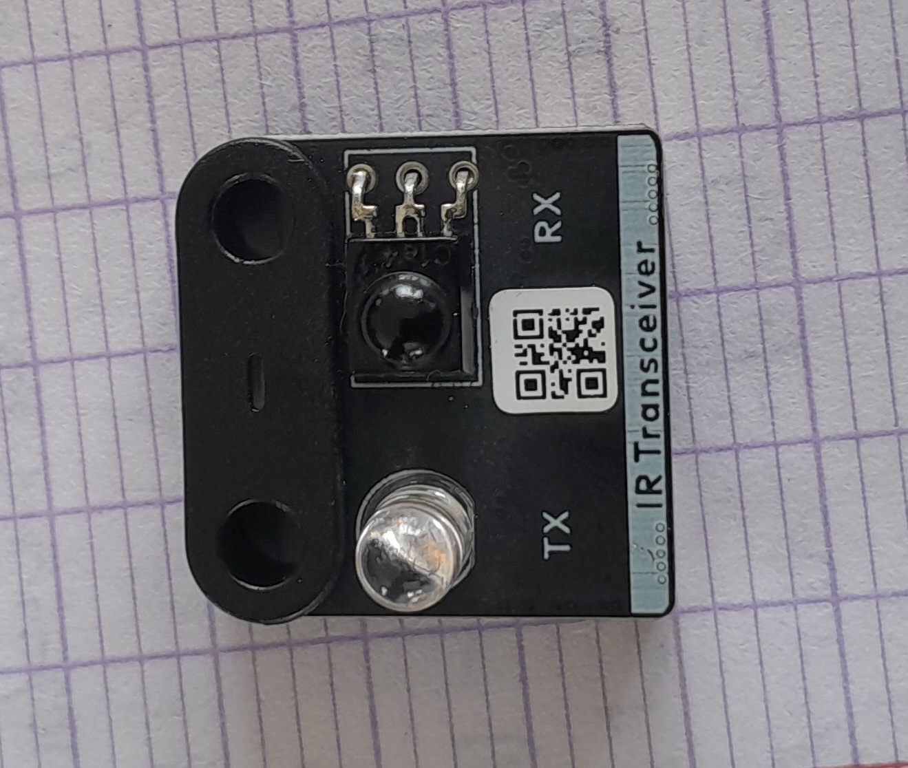
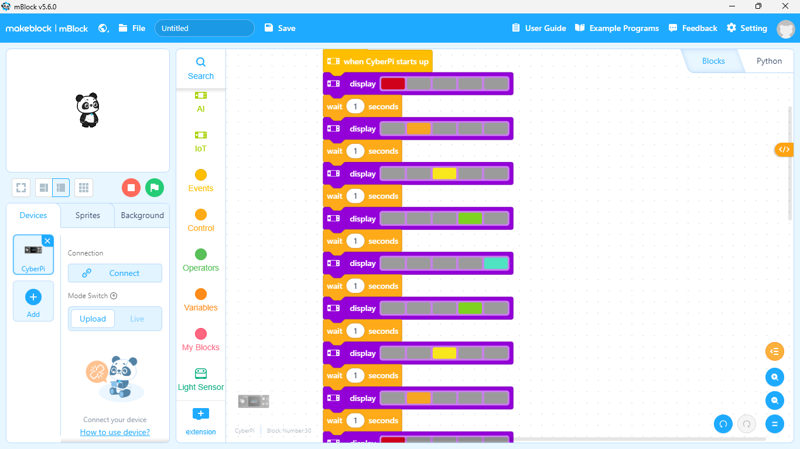
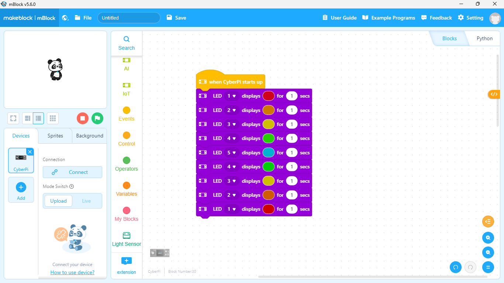
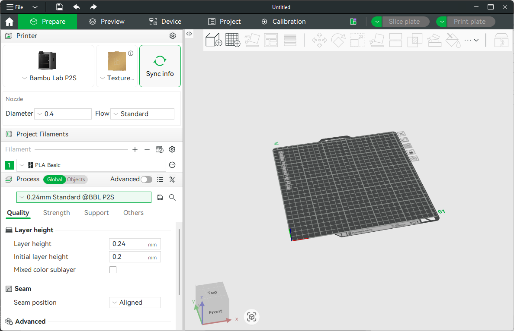
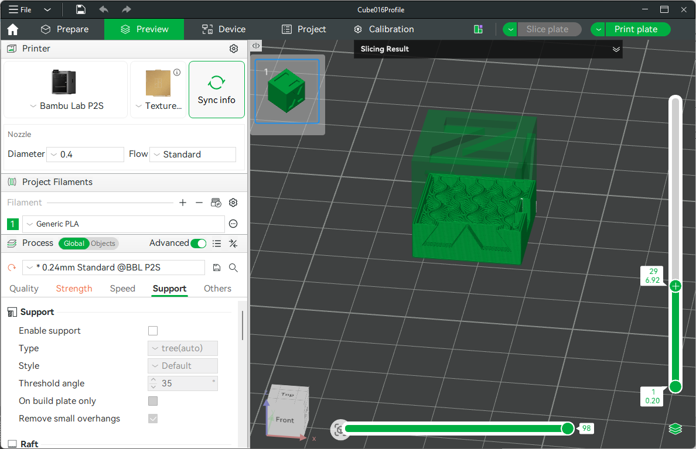

# Journal jeudi 27 août 2026 (rédigé par : Patrice BOMBOMA)

## Fait aujourd'hui

### Atelier découpe LASER
- Conseption et découpe d'une carte de visite

### Atelier électronique

- Généralités sur la CyberPi et l'écosystème mBuild
- Prise de connaissance de quelques materiels electronique

- Installation et généralités du logiciel mBlock
- Progammation d'un code simple

### Atelier impression 3D

- Les étapes du modèle 3D au G-code (Role du slicer)
- Installer les logiciels d'impression 3D (Prusa G-code Viewer et Bambu Studio)
- Paramètré Bambu studio et slicé un modèle 3D

### Atelier projet

- Installer le logiciel Fusion

## Appris

- Conseption et découpe d'une carte de visite
- Les notions de capteurs et d'actionneur
- Prise de connaissance de quelques matériels électroniques (CyberPi, différents capteurs, etc)
- Programmer un code qui allume des LED dans un ordre défini
- Ouvrir un modele 3D et visualiser le G-code

## Raté, puis corrigé

- Découpe non faite → Nous étions nombreux → Les formateurs nous ont proposé de copier nos conceptions et de les découper ultérieurement
- Difficultés à programmer la CyberPi → Réussite après explication des formateurs
- Impression 3D non faite → Dû à la déconnection de l'imprimante et le manque de temps → Les formateurs s'en ont rendu compte et nous ont proposé d'imprimer la prochaine séance
- Difficulté d'installer le logiciel Fision → Dû à la faible qualité de la connection
