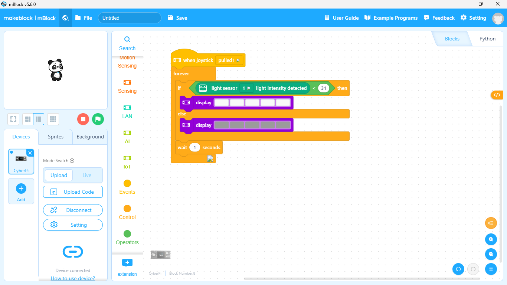
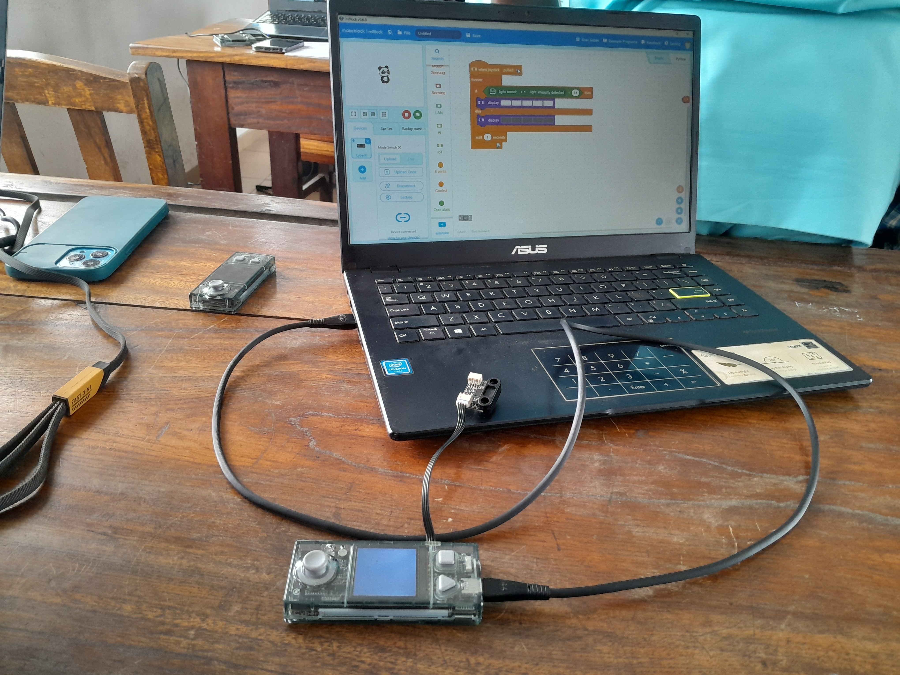
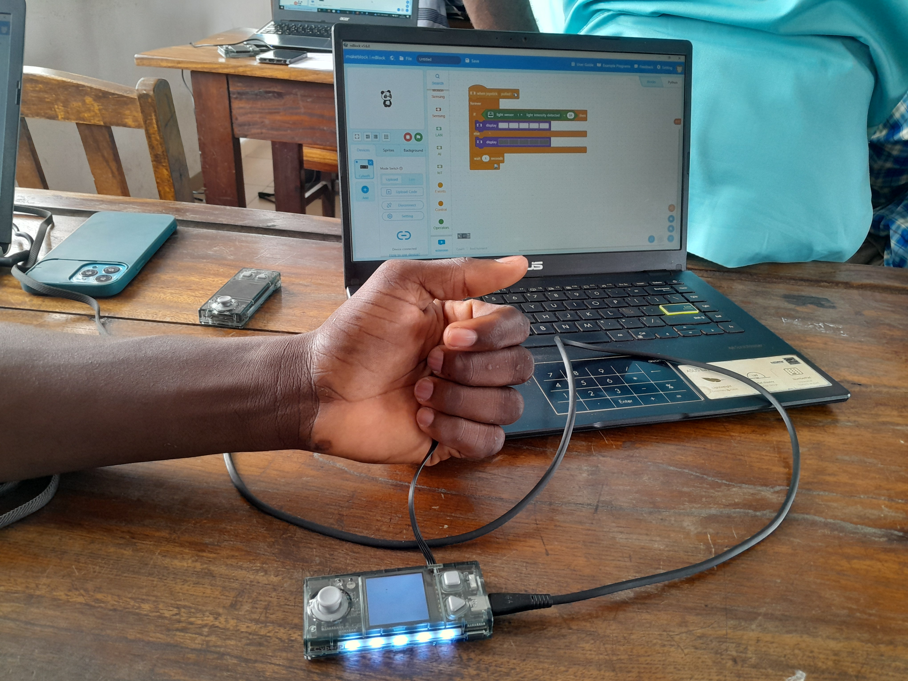
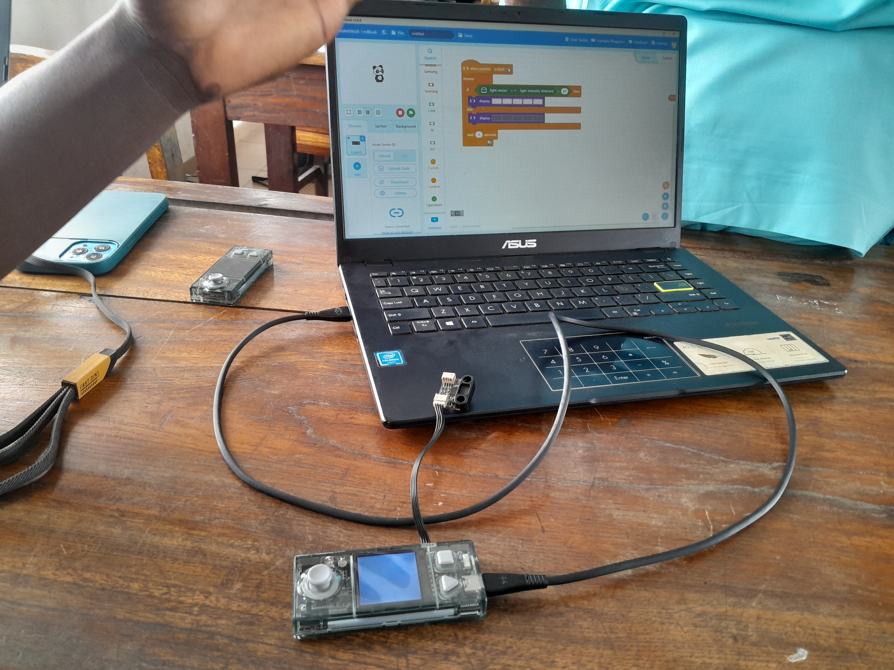
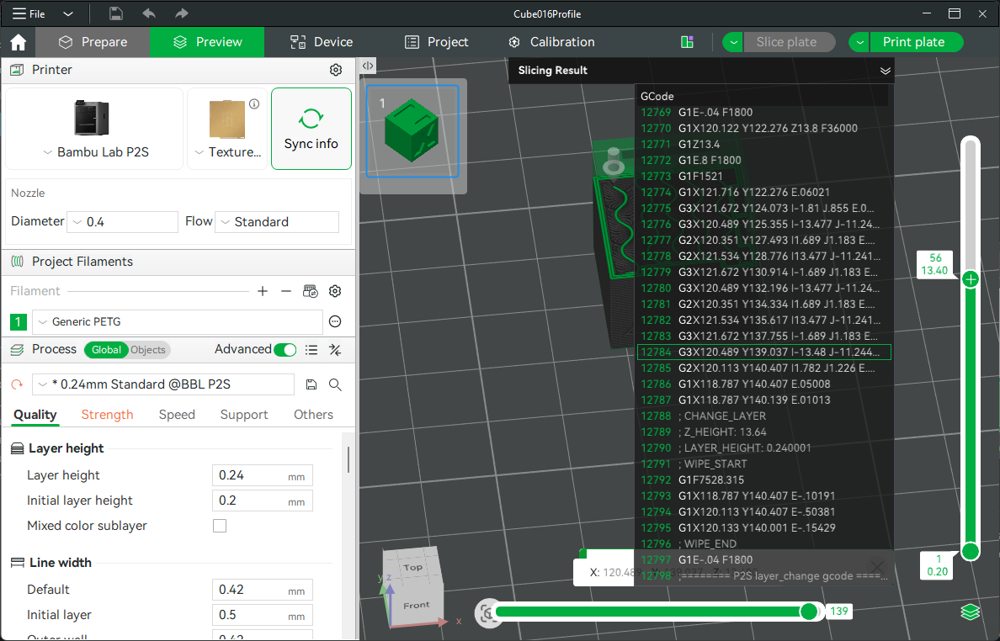
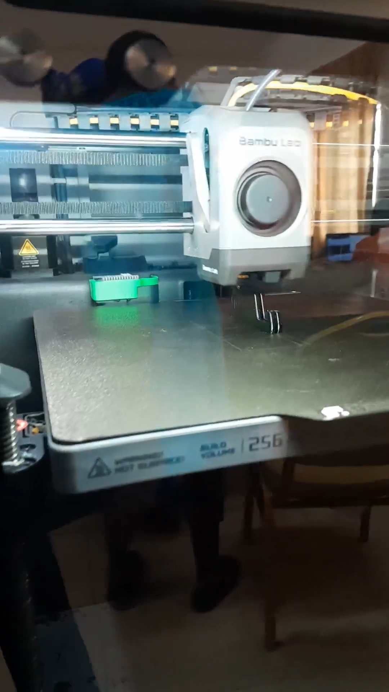
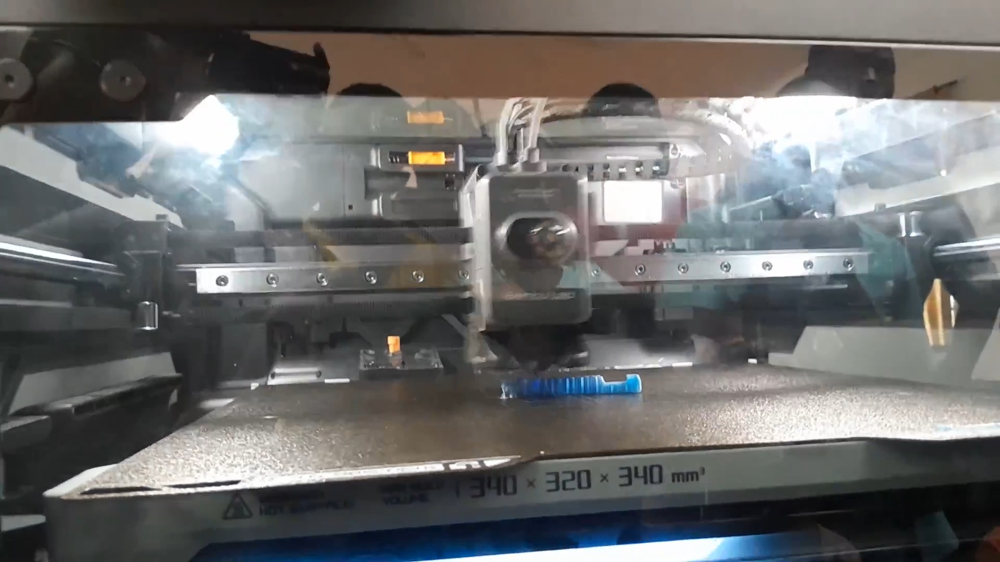

# Journal vendredi 28 août 2026 (rédigé par : Patrice BOMBOMA)

## Fait aujourd'hui

- Terminé l'installation et la configuration de Fusion
- Terminé la configuration de Github et fait un dépôt

### Atelier découpe LASER

- Suivi de la découpe de nos cartes conçus

### Atelier électronique

- Programmé un code permettant d'allumer des LED en fonction de la luminosité ambiante en utilisant un capteur photosensible

### Atelier impression 3D

- Slicé un modèle 3D et lancer son impression

### Atelier projet

- Discussion sur le concept DESIGN THINKING
- Définition et étapes de design thinking

## Appris

- Utiliser les commandes "forever", "si" en programmation electronique
- Faire un programme avec un capteur photosensible

- Utiliser une imprimante 3D pour realiser une impression

- La notion de DESIGN THINKING
- En quoi consiste les 5 étapes: Empathie, Definir, Idée, Prototype et Tester

## À faire demain

- Choix de notre projet de travail
