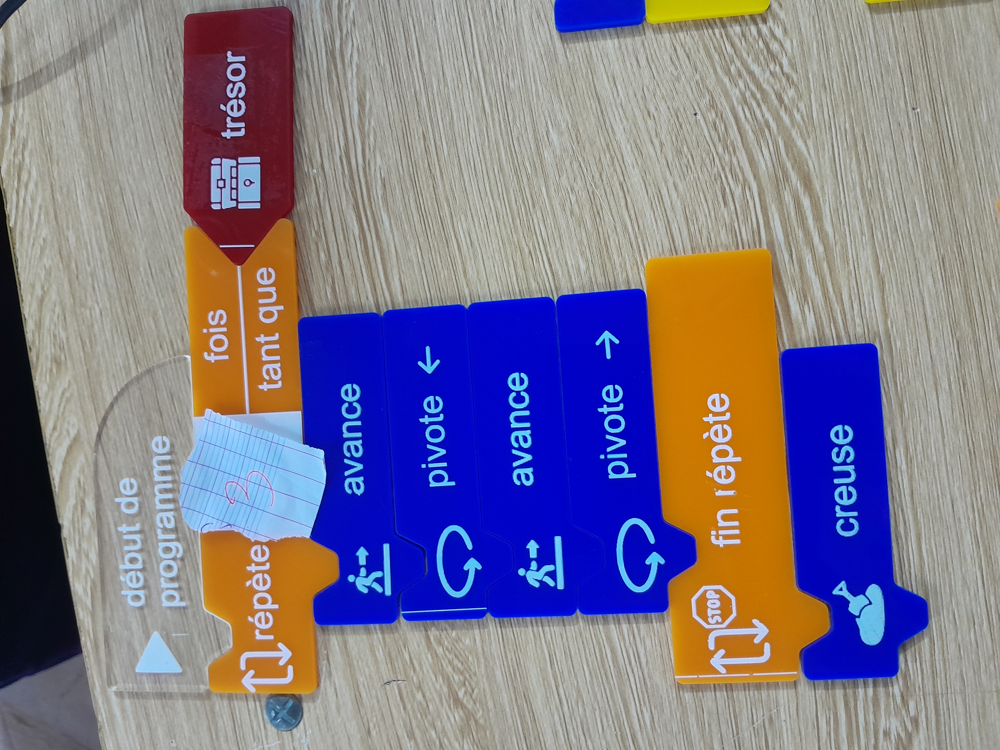
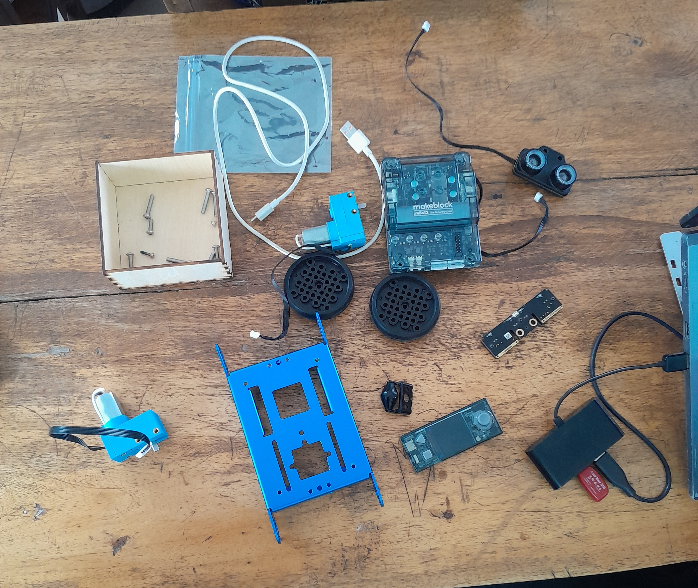
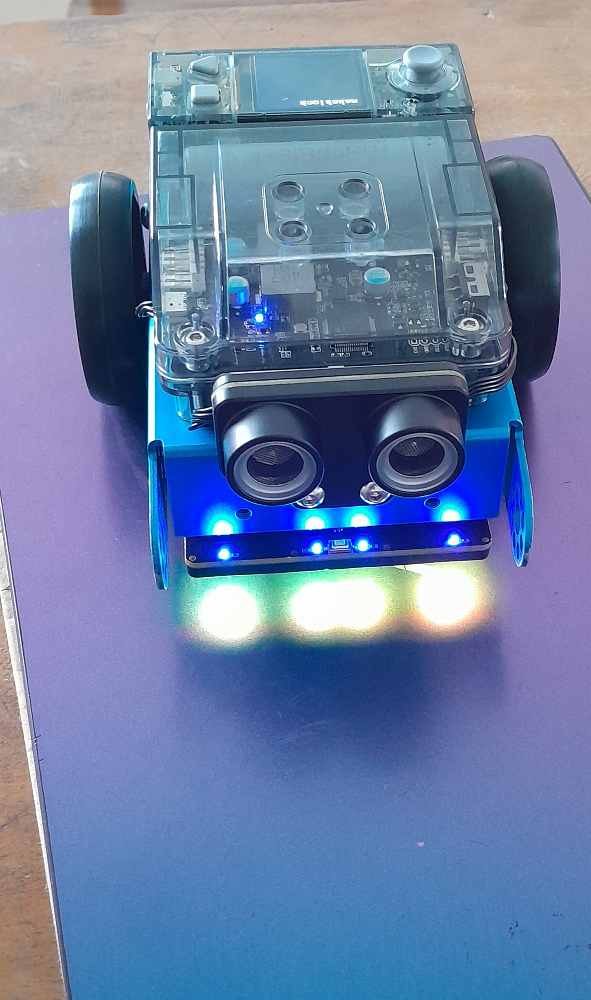
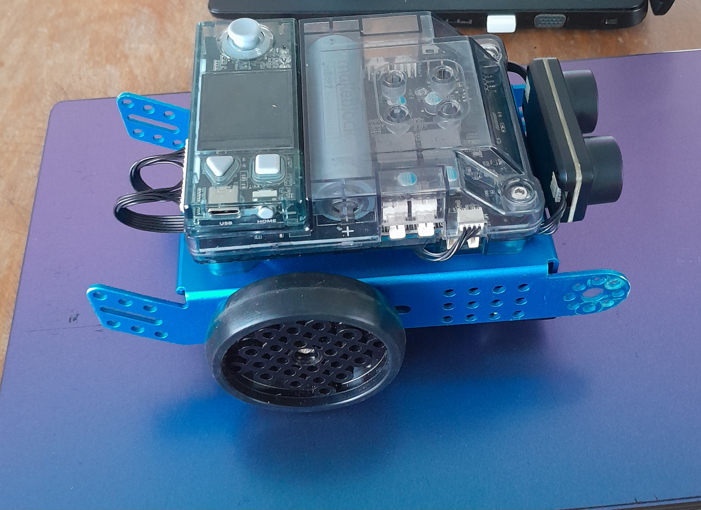
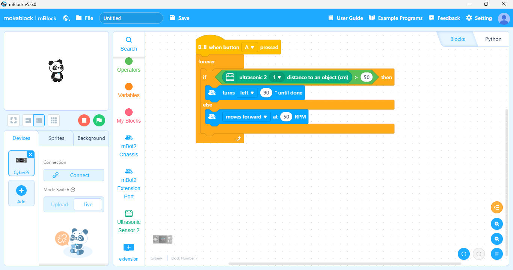
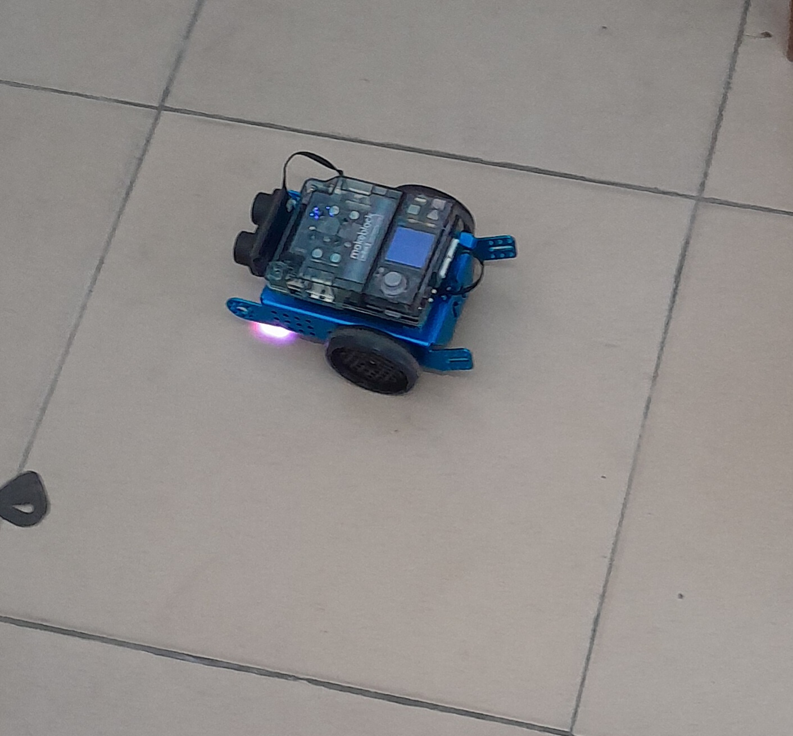
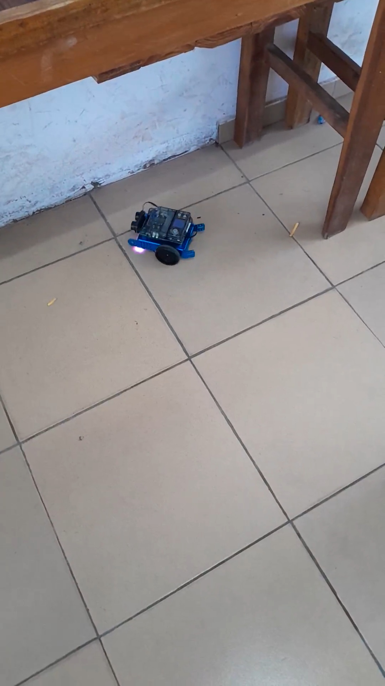

# Journal mercredi 02 septempbre 2026 (rédigé par : Patrice BOMBOMA)

## Fait aujourd'hui

- Discusion en groupe sur nos projets
- Réalise une proposition d'image du prototype de notre projet
- Cours sur l'algorithme débranché
- Construction d'un alogorithme simple en utilisant des pièces en plastique
- Cours pratique sur le robot mBot

## Appris

- Travailler sur un projet commence avec une reflexion sur les bases sans penser aux détails complexes

- Rappelé ce qu'est un algorithme et la notion d'algorithme débranché
- Les critères d'un algorithme
- Construire un algorithme simple en utilisant des pièces en plastique

- Monter et démonter un robot mBot

- Programmer le robot mBot muni de capteurs a ultrasons pour qu'il avance et tourne à gauche lorsqu'il détecte la présence d'un obstacle

## Raté, puis corrigé

- [Le fait] → [hypothèse de cause] → [correction tentée] → [résultat]

## Décidé

- [Arbitrage rendu et son motif] → issue #NN fermée / BOM mise à jour

## À faire demain

- [Action] — Prénom
- [Action] — Prénom
