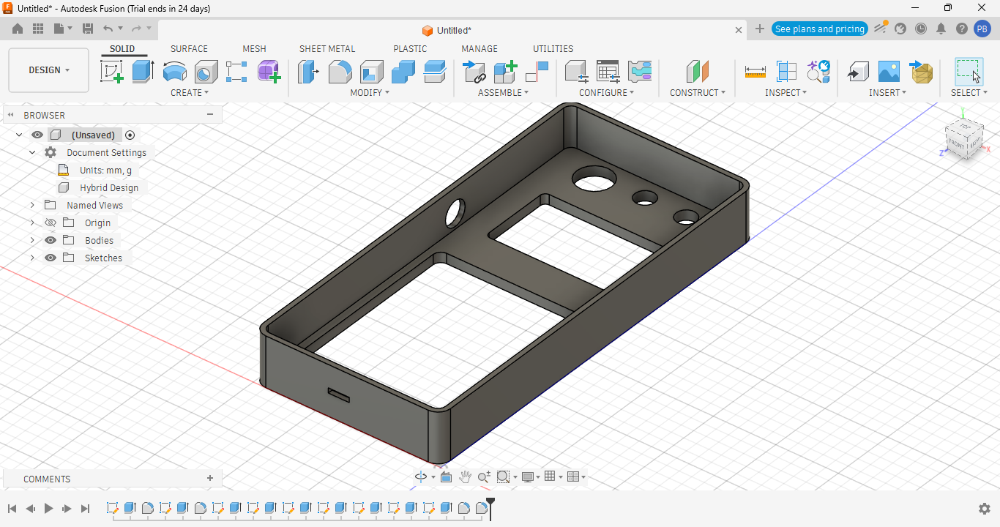
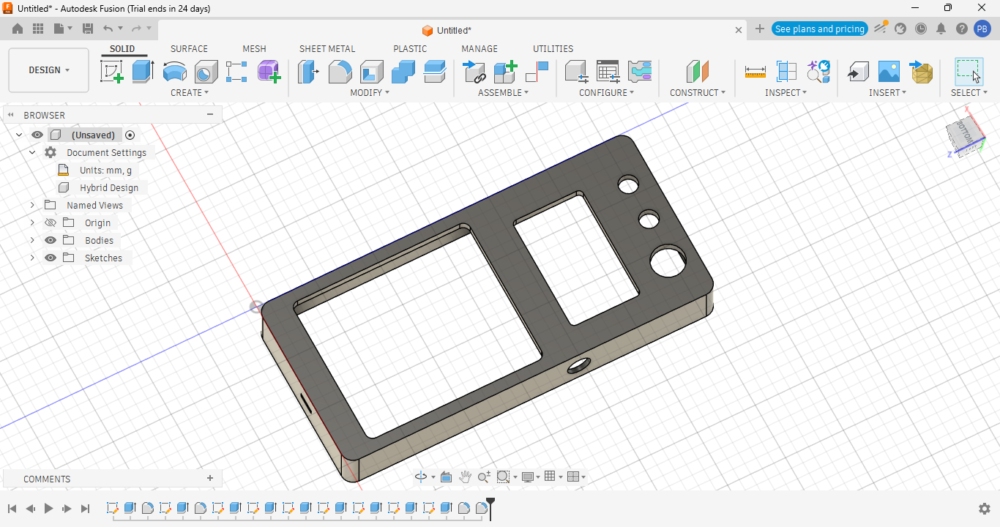
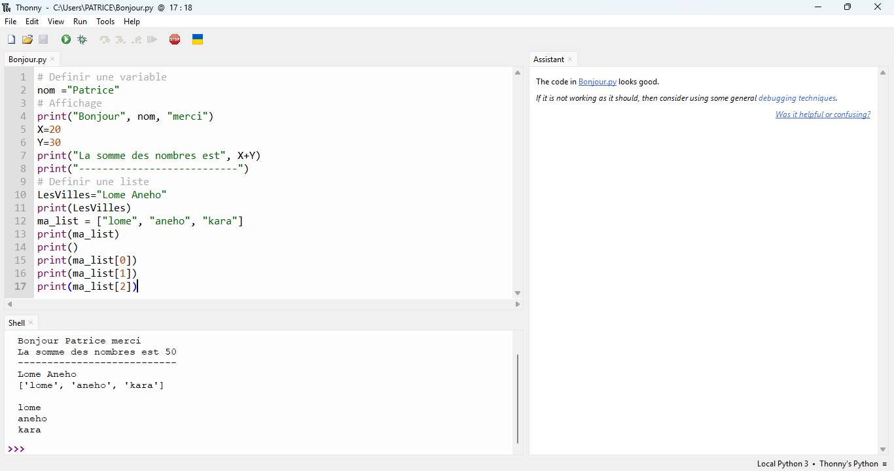
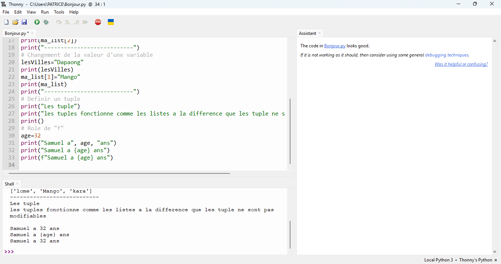
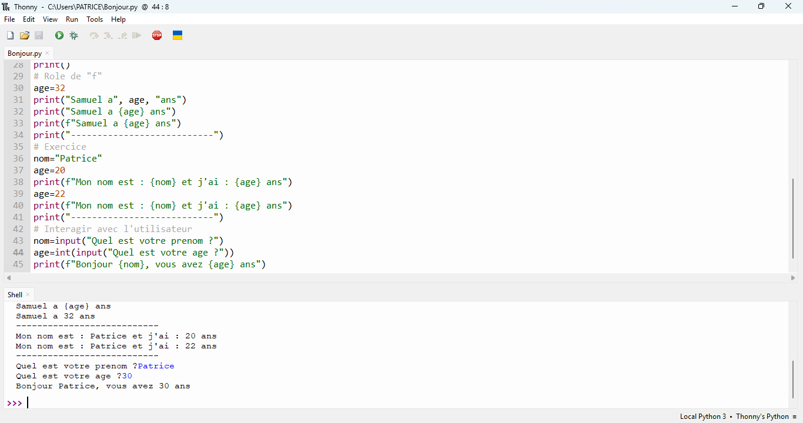
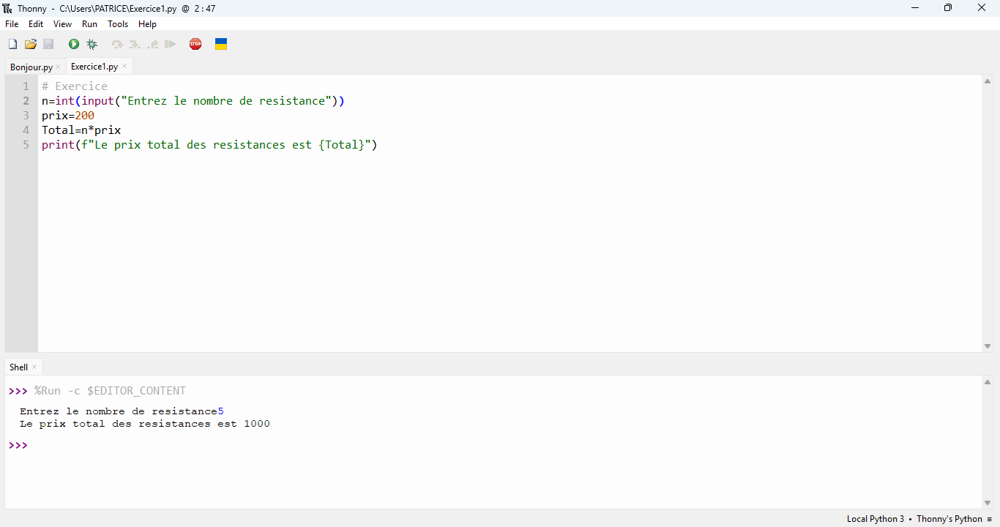

# Journal jeudi 03 septembre 2026 (rédigé par : Patrice BOMBOMA)

## Fait aujourd'hui

- Continuer la discussion sur notre projet
- Recherche sur des composants majeurs a la réalisation de notre projet (Ecran, clavier, battérie et module de recharge de la battérie)
- Installation des logiciels Thommy et cours sur Python pour les fabmanagers

## Appris

- Quelques renseignements sur les composants majeurs de notre projet (Ecran OLED, module de recharge et la battérie)
- Essaye une modélisation 3D d'une partie du boîtier de notre projet sur Fusion

- Ce qu'est Python et quelques notions de base de du langage python
- Ecris quelques exemples de code

