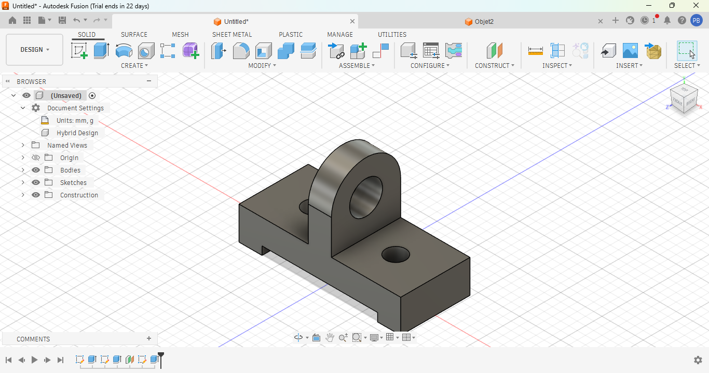

# Journal vendredi 04 septembre 2026 (rédigé par : Patrice BOMBOMA)

## Fait aujourd'hui

- Cours sur le PCB
- Exemple d'impression d'un circuit
- Modélisation de quelques objet en 3D
- Cours sur Python
- Quelques exercices en Python

## Appris

- Ce qu'est un circuit imprimé PCB et son utilité
- Les pincipales méthodes de fabrication d'un PCB
- Les opérateurs indispensables en programmation Python
- Quelques exercices en Python

- Modéliser de quelques objet en 3D

