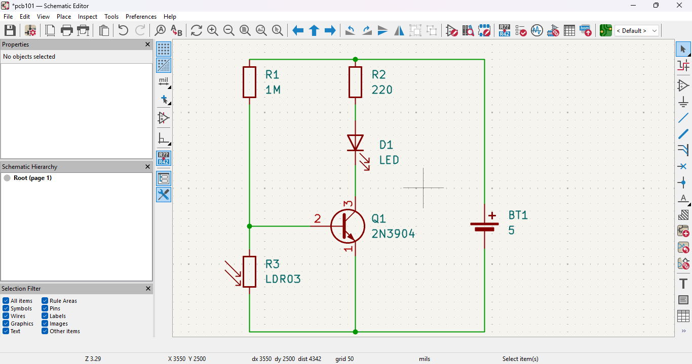
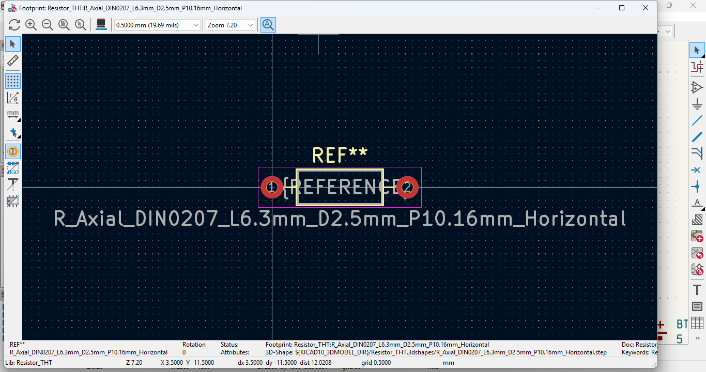
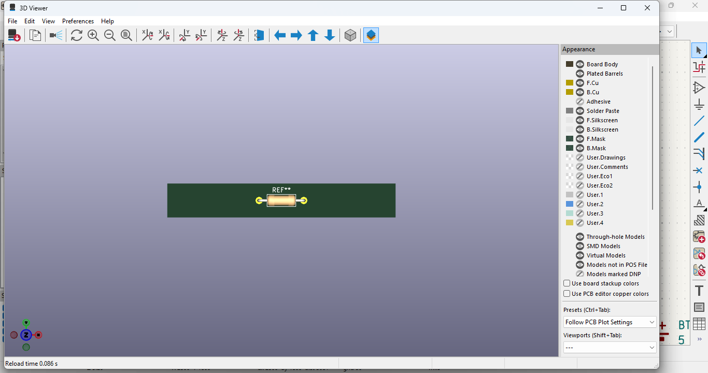
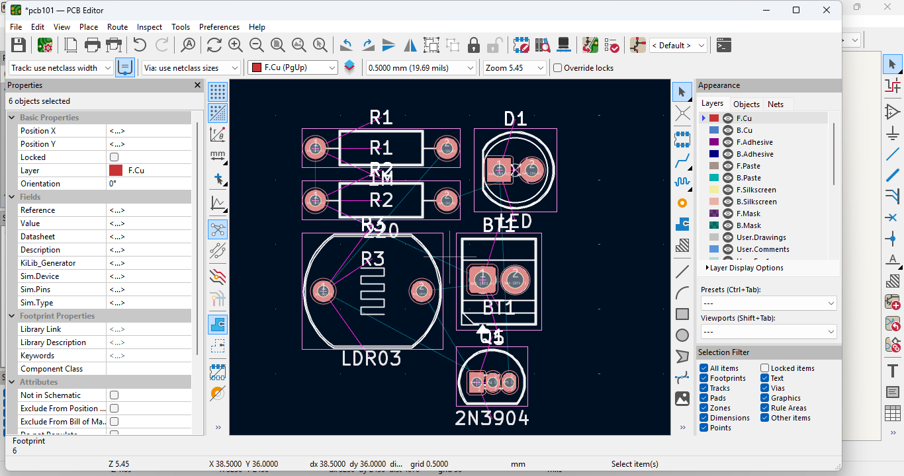
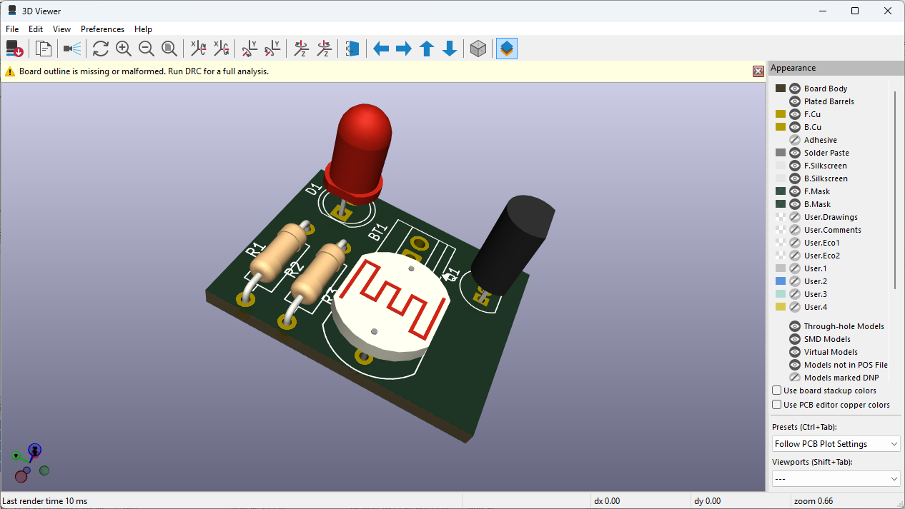
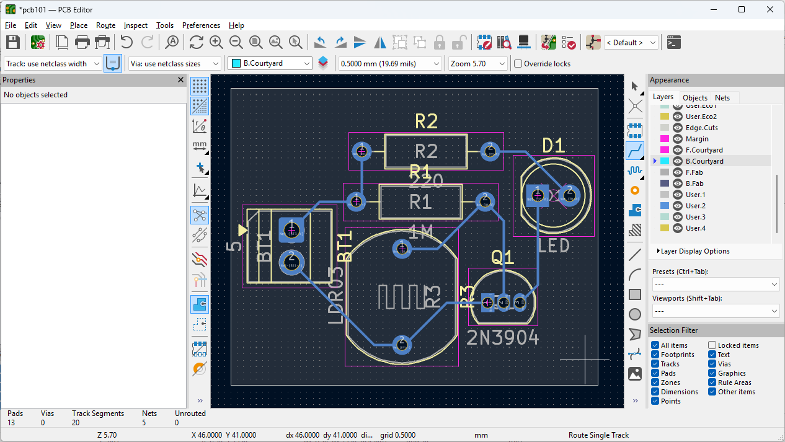
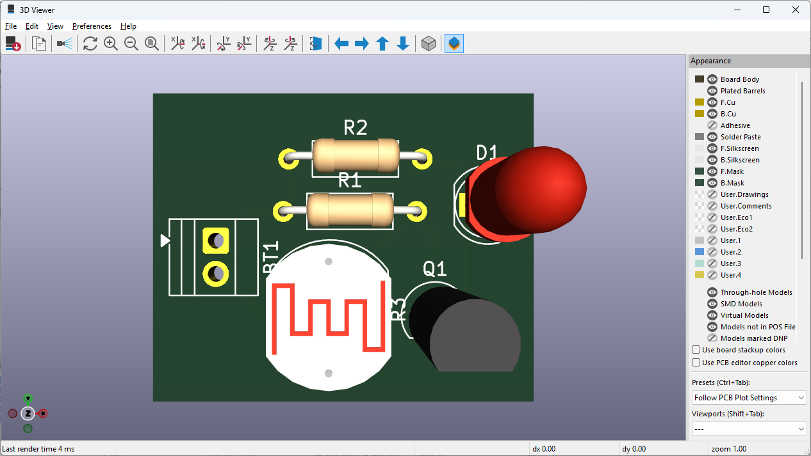
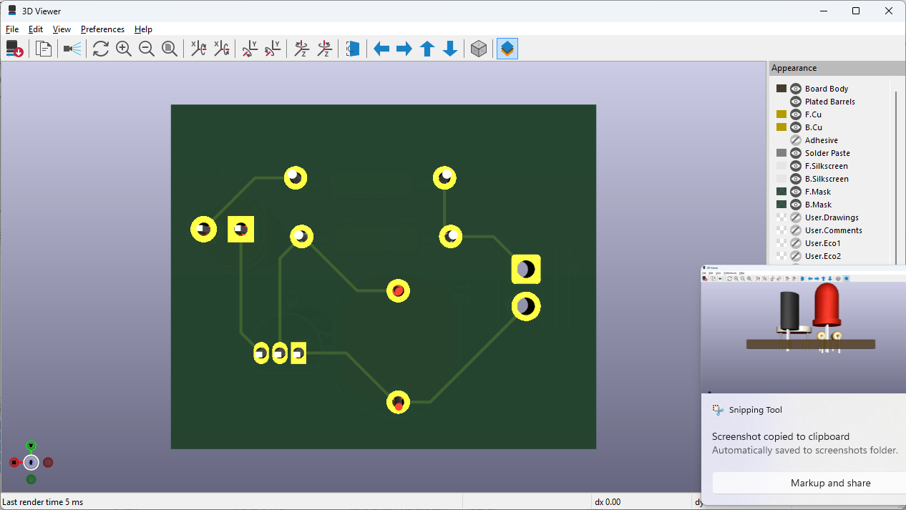

# Journal lundi 07 septembre 2026 (rédigé par : Patrice BOMBOMA)

## Fait aujourd'hui

- Cours sur les circuits imprimes PCB
- Installation et utilisation du logiciel Kicad
- Excercice ce conception d'un PCB utilisant quelques composants de base

## Appris

- Ce qu'est un PCB et son utilité
- Pourquoi passer du prototype au PCB
- Utiliser le logiciel Kicard

- Vérification et correction des erreurs et avertissents d'un circuit
- Visualisation 2D et 3D d'un composant

- Réaliser un montage électronique composé de résistances, LED, transistor NPN, résistance photosensible et d'un battérie

- Realiser le routage d'un circuit

## Raté, puis corrigé

- Difficulté de suivre au début → Le PC était lent → Redémarrage → Possibilité de suivre

## À faire pour demain

- Concevoir un montage comprenant des composants indiqués comme exercice
