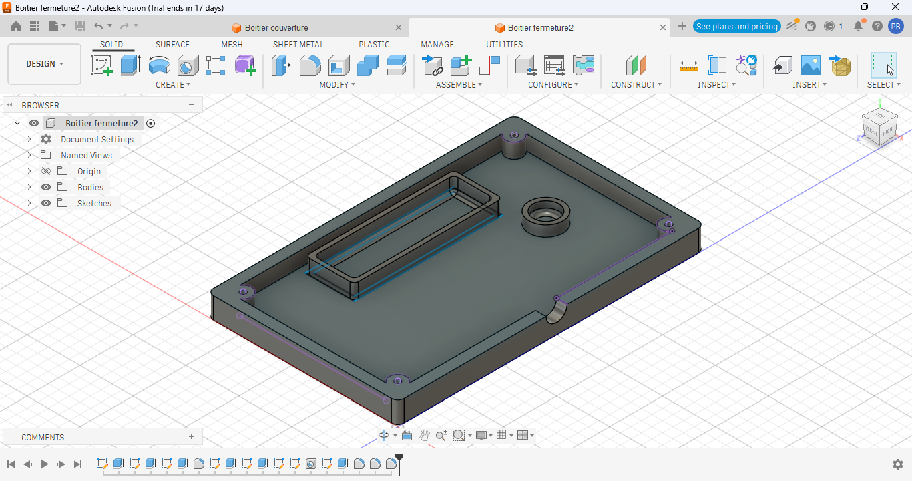
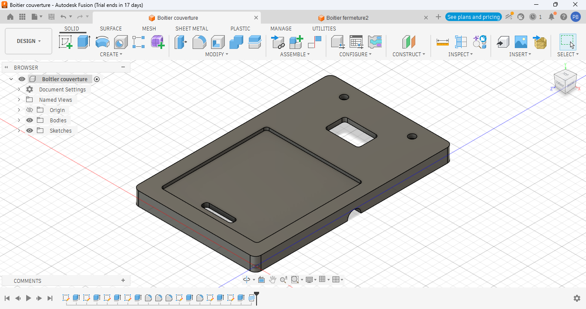
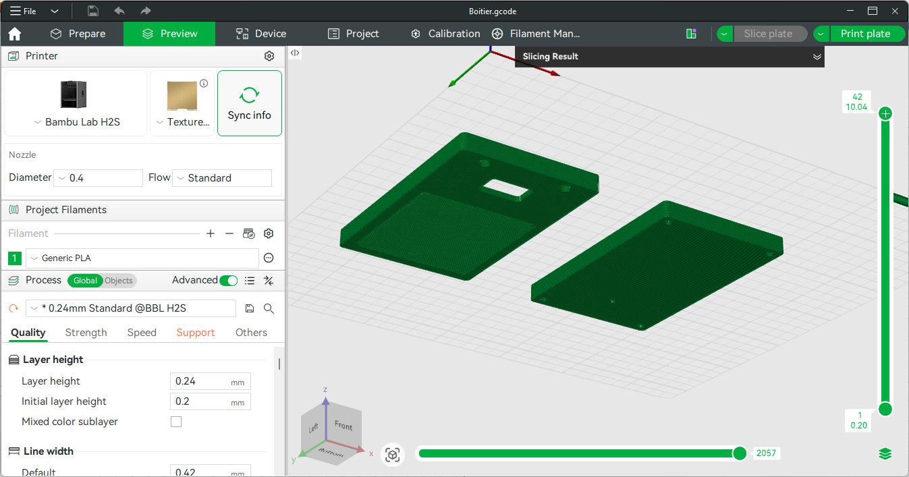
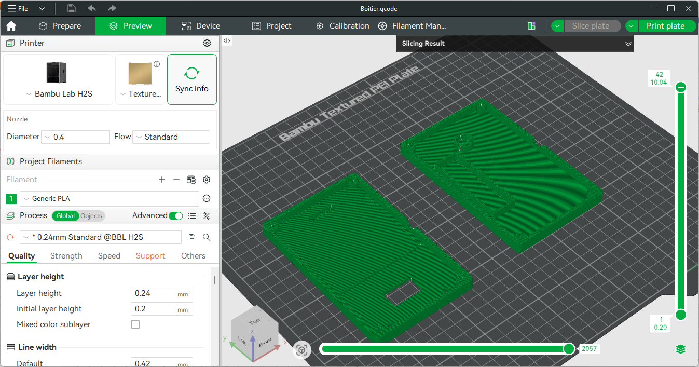

# Journal — jeudi 10 septembre 2026 (rédigé par : Patrice BOMBOMA)

## Fait aujourd'hui

- Suite du travail en groupe sur nos projets
- Suite de la conception 3D du boitier de notre projet
- Nous avons diminuer l'epaisseur des parois du boitier de 5mm a 3mm sur la recommandation de nos formateurs
- Nous avons lance l'impression 3D de notre boitier
- Nous avons fait le montage sur un breadbord pour faire un test en utilisant un XIAO ESP32S3, un clavier 4x4, un ecran OLED, des fils de connection
- Nous avons a l'aide de l'IA obtenu un programme de code qui nous a permis de relier le ESP32S3 au clavier et a l'ecran et de faire le test du fonctionnement

## Appris

- Modifier certaines dimensions d'un objet modelise en 3D avec Fusion
- Utiliser de nouvelles fonctionalites de Fusion

- realiser un montage reliant des composants comme un ESP32S3, un clavier 4x4, un ecran OLED sur un breadbord
- Televerser un programme de code dans un ESP32S3 et l'executer

## Raté, puis corrigé

- Nous avons eu beaucoup trop du mal a modifier l'epaisseur la parois du boitier → Beaucoup d'autres etapes ont ete fait apres dependant de l'esquise permettant de definir cette epaisseur. la modification de l'epaisseur entraine la deformmation ou suppression des etapes ulterieurs qui en dependent → Faire une autre esquise et estusion suplementaire permettant de diminuer l'epaisseur des parois et refaire les conges des bords → Nous avons reussit a faire la modification souhaite
- Nous n'avons pas reussi a relier les deux LED et le beseur au ESP32S3 → Nous avons ete limite par le nombre de broches disponible sur ESP32S3 car sur les 11 broches de data disponibles, le clavier en a occupe 8, le OLED en a occupe 2, il n'en reste qu'un seul → Nous allons continuer les recherches pour trouver une solution si possible

## À faire demain

- Apprecier la forme du boitier une fois l'impression termine et envisager des modifications si necessaire
- Essayer d'ajouter deux LED (rouge et vert) et un beseur a notre circuit sur breadbord
- Modifier le programme code permettant d'utiliser les LED et le beseur dans l'execution du projet
